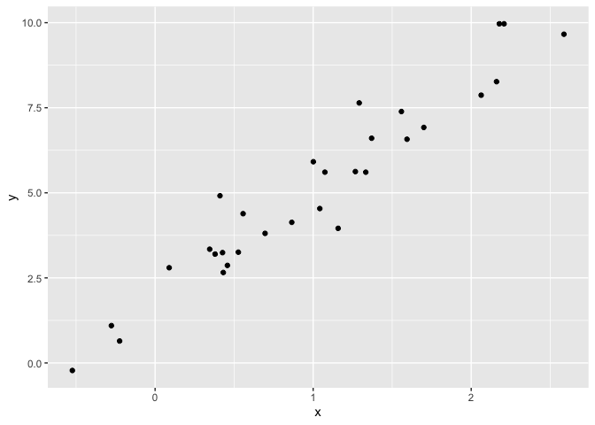

iteration
================
Hannah Bowlin
10/24/2019

# Get Started

``` r
x = rnorm(30, mean = 4, sd = 2.3)
x_again = rnorm(25, mean = 4, sd = 2.5)
y = rnorm(20, mean = 5, sd = 2)

# z scores for this vector
z_scores = function(x) {
  
  z = (x - mean(x)) / sd(x)
  z
  
}

z_scores(x)
```

    ##  [1] -0.767120446  0.109493425 -0.993470503  1.637039863  0.267334741
    ##  [6] -0.977065475  0.438222871  0.709719461  0.533829741 -0.419692475
    ## [11]  1.546684110  0.332624325 -0.761479160 -2.485776741  1.128069748
    ## [16] -0.137851865 -0.106748415  0.932105430  0.799422547  0.553437533
    ## [21]  0.905205442  0.757128408 -0.008541293 -2.241925304  0.581490604
    ## [26] -0.149966223 -0.257816586 -1.680744021 -0.606639531  0.363029790

# Creating the function

``` r
z_scores = function(x_arg) {
  
  z = (x_arg - mean(x_arg)) / sd(x_arg)
  z
  
}

z_scores(x)
```

    ##  [1] -0.767120446  0.109493425 -0.993470503  1.637039863  0.267334741
    ##  [6] -0.977065475  0.438222871  0.709719461  0.533829741 -0.419692475
    ## [11]  1.546684110  0.332624325 -0.761479160 -2.485776741  1.128069748
    ## [16] -0.137851865 -0.106748415  0.932105430  0.799422547  0.553437533
    ## [21]  0.905205442  0.757128408 -0.008541293 -2.241925304  0.581490604
    ## [26] -0.149966223 -0.257816586 -1.680744021 -0.606639531  0.363029790

``` r
z_scores(x_arg = x)
```

    ##  [1] -0.767120446  0.109493425 -0.993470503  1.637039863  0.267334741
    ##  [6] -0.977065475  0.438222871  0.709719461  0.533829741 -0.419692475
    ## [11]  1.546684110  0.332624325 -0.761479160 -2.485776741  1.128069748
    ## [16] -0.137851865 -0.106748415  0.932105430  0.799422547  0.553437533
    ## [21]  0.905205442  0.757128408 -0.008541293 -2.241925304  0.581490604
    ## [26] -0.149966223 -0.257816586 -1.680744021 -0.606639531  0.363029790

``` r
z_scores(x_arg = y)
```

    ##  [1]  1.554640240 -0.478416888 -1.064628582  0.332980900 -0.277358693
    ##  [6]  1.919417962 -0.194382554  0.436918860 -0.136150355 -0.804080414
    ## [11]  0.003095073 -1.723507684  1.108780706 -0.027681925  1.721097028
    ## [16]  0.251394272 -0.775219183  0.368493022 -0.969335747 -1.246056039

``` r
# doesnt work always for charcter vectors or factors
z_scores(x_arg = 3)
```

    ## [1] NA

``` r
# z_scores(x = "my name is hannah")
z_scores(x_arg = c(TRUE, TRUE , FALSE, TRUE))
```

    ## [1]  0.5  0.5 -1.5  0.5

# Conditional execution

``` r
z_scores = function(x_arg) {
  
  if (!is.numeric(x_arg)) {
    stop("Argument x should be numeric")
  } else if (length(x_arg) == 1) {
    stop("Z scores cannot be computed for length 1 vectors")
  }
  
  z = mean(x) / sd(x)
  
  z
}
```

## Multiple outputs

``` r
mean_and_sd = function(x_arg) {
  
  if (!is.numeric(x_arg)) {
    stop("Argument x should be numeric")
  } else if (length(x_arg) == 1) {
    stop("Cannot be computed for length 1 vectors")
  }
  
  mean_x = mean(x_arg)
  sd_x = sd(x_arg)

  list(mean = mean_x, 
       sd = sd_x)
}
```

``` r
mean_and_sd = function(x_arg) {
  
  if (!is.numeric(x_arg)) {
    stop("Argument x should be numeric")
  } else if (length(x_arg) < 3) {
    stop("x should be longer than 3")
  }
  
  mean_x = mean(x_arg)
  sd_x = sd(x_arg)

  list(mean = mean_x, 
       sd = sd_x)
}
```

``` r
mean_and_sd = function(x_arg) {
  
  if (!is.numeric(x_arg)) {
    stop("Argument x should be numeric")
  } else if (length(x_arg) < 3) {
    stop("x should be longer than 3")
  }
  
  mean_x = mean(x_arg)
  sd_x = sd(x_arg)

  list(mean = mean_x, 
       sd = sd_x,
       z_scores = (x_arg - mean(x_arg)) / sd(x_arg))
}
```

``` r
mean_and_sd = function(x_arg) {
  
  if (!is.numeric(x_arg)) {
    stop("Argument x should be numeric")
  } else if (length(x_arg) == 1) {
    stop("Cannot be computed for length 1 vectors")
  }
  
  mean_x = mean(x_arg)
  sd_x = sd(x_arg)

  tibble(
    mean = mean_x, 
    sd = sd_x
  )
}
```

# Multiple Inputs

## Linear regression, beta0\_hat is the beta coefficient

``` r
sim_data = tibble(
  x = rnorm(30, mean = 1, sd = 1),
  y = 2 + 3 * x + rnorm(30, 0, 1)
)

ls_fit = lm(y ~ x, data = sim_data)
  
beta0_hat = coef(ls_fit)[1]
beta1_hat = coef(ls_fit)[2]

sim_data %>% 
  ggplot(aes(x = x, y = y)) + 
  geom_point()
```

<!-- --> \#\#
Here we have set beta 1 and beta0 by default

``` r
sim_regression = function(n, beta0 = 2, beta1 = 3) {
  
  sim_data = tibble(
    x = rnorm(n, mean = 1, sd = 1),
    y = beta0 + beta1 * x + rnorm(n, 0, 1)
  )
  
  ls_fit = lm(y ~ x, data = sim_data)
  
  tibble(
    beta0_hat = coef(ls_fit)[1],
    beta1_hat = coef(ls_fit)[2]
  )
}
sim_regression(n = 100, beta0 = 23)
```

    ## # A tibble: 1 x 2
    ##   beta0_hat beta1_hat
    ##       <dbl>     <dbl>
    ## 1      23.1      2.96

``` r
sim_regression(n = 30)
```

    ## # A tibble: 1 x 2
    ##   beta0_hat beta1_hat
    ##       <dbl>     <dbl>
    ## 1      1.65      3.38

``` r
sim_regression(n = 3000)
```

    ## # A tibble: 1 x 2
    ##   beta0_hat beta1_hat
    ##       <dbl>     <dbl>
    ## 1      1.95      3.02

# Now we’re having users put in beta0 and beta1 into the function

``` r
sim_regression = function(n, beta0, beta1) {
  
  sim_data = tibble(
    x = rnorm(n, mean = 1, sd = 1),
    y = beta0 + beta1 * x + rnorm(n, 0, 1)
  )
  
  ls_fit = lm(y ~ x, data = sim_data)
  
  tibble(
    beta0_hat = coef(ls_fit)[1],
    beta1_hat = coef(ls_fit)[2]
  )
}

sim_regression(n = 30, beta0 = 17, beta1 = -3)
```

    ## # A tibble: 1 x 2
    ##   beta0_hat beta1_hat
    ##       <dbl>     <dbl>
    ## 1      17.4     -3.22

``` r
sim_regression(n = 3000, beta0 = 24, beta1 = 3)
```

    ## # A tibble: 1 x 2
    ##   beta0_hat beta1_hat
    ##       <dbl>     <dbl>
    ## 1      24.0      2.98

# reading in data from the web and creating a function from that

``` r
url = "https://www.amazon.com/product-reviews/B00005JNBQ/ref=cm_cr_arp_d_viewopt_rvwer?ie=UTF8&reviewerType=avp_only_reviews&sortBy=recent&pageNumber=1"

dynamite_html = read_html(url)

review_titles = dynamite_html %>%
  html_nodes("#cm_cr-review_list .review-title") %>%
  html_text()

review_stars = dynamite_html %>%
  html_nodes("#cm_cr-review_list .review-rating") %>%
  html_text()

review_text = dynamite_html %>%
    html_nodes(".review-data:nth-child(4)") %>%
    html_text()

reviews = tibble(
  title = review_titles,
  stars = review_stars,
  text = review_text
)
```

``` r
read_page_reviews <- function(url) {
  
  h = read_html(url)
  
  review_titles = h %>%
    html_nodes("#cm_cr-review_list .review-title") %>%
    html_text()
  
  review_stars = h %>%
    html_nodes("#cm_cr-review_list .review-rating") %>%
    html_text() %>%
    str_extract("\\d") %>%
    as.numeric()
  
  review_text = h %>%
    html_nodes(".review-data:nth-child(4)") %>%
    html_text()
  
  tibble(
    title = review_titles,
    stars = review_stars,
    text = review_text
  )
}
```

``` r
url_base = "https://www.amazon.com/product-reviews/B00005JNBQ/ref=cm_cr_arp_d_viewopt_rvwer?ie=UTF8&reviewerType=avp_only_reviews&sortBy=recent&pageNumber="
vec_urls = str_c(url_base, 1:5)

dynamite_reviews = bind_rows(
  read_page_reviews(vec_urls[1]),
  read_page_reviews(vec_urls[2]),
  read_page_reviews(vec_urls[3]),
  read_page_reviews(vec_urls[4]),
  read_page_reviews(vec_urls[5])
)

dynamite_reviews
```

    ## # A tibble: 50 x 3
    ##    title                               stars text                          
    ##    <chr>                               <dbl> <chr>                         
    ##  1 "Great movie\n            "             5 Format: Blu-rayVerified Purch…
    ##  2 "Duh\n            "                     5 Format: Prime VideoVerified P…
    ##  3 "Great video\n            "             5 Format: DVDVerified Purchase  
    ##  4 "Give me some of your tots\n      …     5 Format: Prime VideoVerified P…
    ##  5 "Nostalgic\n            "               5 Format: Prime VideoVerified P…
    ##  6 "Make you giggle type movie\n     …     5 Format: Blu-rayVerified Purch…
    ##  7 "This movie is so stupid.\n       …     5 Format: Prime VideoVerified P…
    ##  8 "Hilarious\n            "               5 Format: Prime VideoVerified P…
    ##  9 "Waste of money\n            "          1 Format: Prime VideoVerified P…
    ## 10 "Good movie\n            "              5 Format: Prime VideoVerified P…
    ## # … with 40 more rows
